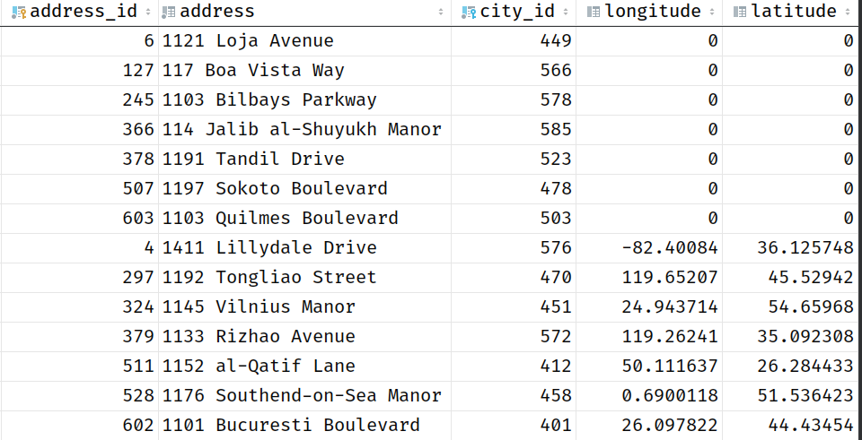

# DB-Course

### Author
BS20-02

Iskander Nafikov, i.nafikov@innopolis.university

## Exercise 1
Please, check files 'ex1.sql', 'ex2.sql'

### Here is output after code execution:

### Exercise 2
Please, check file 'ex2.sql'
