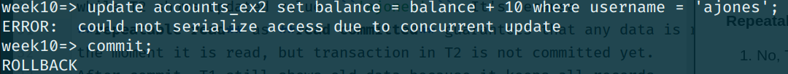
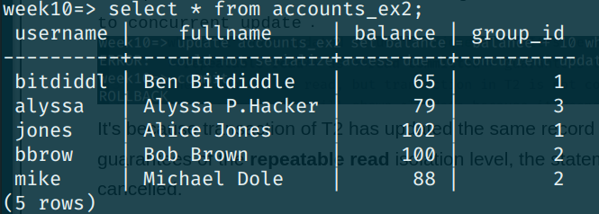
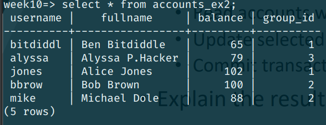

# DB-Course

### Author
BS20-02

Iskander Nafikov, i.nafikov@innopolis.university

## Exercise 1
Please, check file ```ex1.sql```


## Exercise 2
Please, check file ```ex2.sql``` *(creating table and 
inserting data)*

### Page 1

#### Read Committed
1. No, T1 terminal shows still shows ```'jones'```,
while T2 shows updated value ```'ajones'```. It's because
**read committed** guarantees that any data is read is committed at
the moment it is read, but transaction in T2 is not committed yet.
After commit, T1 and T2 shows the same data.
2. After update statement T2 starts blocking state and waits for
commit of T2 transaction since they both holds the same record changed.

#### Repeatable Read
1. No, T1 terminal shows still shows ```'jones'```,
while T2 shows updated value ```'ajones'```. It's because
**repeatable read** as **read committed** guarantees that any data is read is committed at
the moment it is read, but transaction in T2 is not committed yet.
After commit, T1 still shows old data because it keeps all records
that were read in current transaction. T2 shows new data.
2. T1 ```update``` won't work with such a message:
```could not serialize access due to concurrent update```.

It's because transaction of T2 has updated the same record (*Alice*)
and due to the guarantees of the **repeatable read** 
isolation level, the statement in this session was cancelled.

### Page 2

#### Read Committed
The result is following:


We can see that at first ```mike``` has got +15 to balance but ```bbrow```
has not. It's because T1 transaction was processing while T2 transaction
has not been committed yet, so ```bbrow``` has not been in group 2 yet.

#### Repeatable Read
The result is following:


We can see that the result is the same as in **read committed**.
There are no errors because T2 updated record which had not been
read by T1. Therefore, T2 & T2 updated different records and obtain
the same result.
